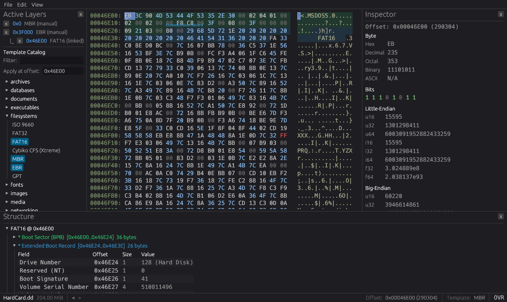

<p align="center">
  
</p>

<h1 align="center">Hexenly</h1>

<p align="center">
  A hex editor that understands binary formats.<br>
  Built with Rust and <a href="https://github.com/emilk/egui">egui</a>.
</p>

---

<p align="center">
  
</p>

Hexenly lets you open any file and see its raw bytes in a side-by-side hex + ASCII view. What makes it different is **templates** — structured overlays that color-code regions, decode fields, and show you what each byte actually means. Open a PNG and immediately see the IHDR chunk, image dimensions, and color type. Open a ZIP and watch it walk through every local file entry.  This program was written heavily with Claude with me learning Rust.

Templates are simple TOML files you can write yourself, with support for dynamic field lengths, repeating sections, conditional regions, and arithmetic expressions.

## Getting Started

**Download** a pre-built binary from the [Releases](https://github.com/hexenly/hexenly/releases) page, or build from source:

```sh
cargo build --release
```

Then run it:

```sh
# Launch empty
cargo run -p hexenly-app

# Open a file directly
cargo run -p hexenly-app -- path/to/file.png
```

You can also just drag and drop a file onto the window.

### Build Requirements

- Rust 1.85+
- On Linux: display server dev packages
  - Fedora: `sudo dnf install libxcb-devel libxkbcommon-devel wayland-devel`
  - Ubuntu/Debian: `sudo apt install libxcb-shape0-dev libxcb-xfixes0-dev libxkbcommon-dev`

## Features

**Viewing**
- Hex + ASCII display with configurable column widths (8, 16, 24, or 32)
- Byte inspector showing values as integers, floats, and strings in both endianness
- Hex and text search with match navigation
- Go-to-offset (decimal or `0x` hex)

**Editing**
- Insert and overwrite modes (toggle with `Insert` key)
- Full undo/redo history
- Nibble-level hex input and ASCII pane editing
- Save and Save As with atomic writes

**Templates**
- 15 built-in templates across images, archives, executables, filesystems, and media
- Auto-detection via magic bytes or file extension
- Structure panel with decoded field values — click any field to jump to its offset
- Color-coded hex overlay showing which bytes belong to which region
- Write your own templates in TOML (see `templates/` for examples)

## Keyboard Shortcuts

| Shortcut | Action |
|----------|--------|
| `Ctrl+O` | Open file |
| `Ctrl+S` | Save |
| `Ctrl+Shift+S` | Save As |
| `Ctrl+Z` | Undo |
| `Ctrl+Y` | Redo |
| `Ctrl+F` | Search |
| `Ctrl+G` | Go to offset |
| `Ctrl+A` | Select all |
| `Insert` | Toggle insert/overwrite mode |
| `Esc` | Close dialog |

## Built-in Templates

| Format | Coverage |
|--------|----------|
| **Images** | |
| PNG | Signature + IHDR chunk |
| BMP | File header + DIB header |
| GIF | Header + logical screen descriptor |
| JPEG | SOI marker + APP0/JFIF segment |
| **Archives** | |
| ZIP | Local file entries (repeating, dynamic field lengths) |
| TAR | USTAR file header block |
| GZIP | Header with flags and OS identification |
| **Executables** | |
| ELF | Identification + 64-bit header |
| PE/COFF | DOS header + PE signature + COFF + optional header |
| **Filesystems** | |
| FAT32 | Boot sector + BPB + FSInfo |
| ISO 9660 | Primary volume descriptor + path table |
| MBR | Boot code + 4 partition entries + signature |
| GPT | GPT header + first partition entry |
| Cybiko CFS | Xtreme flash filesystem (boot blocks + file pages) |
| **Media** | |
| WAV | RIFF header + format chunk + data chunk |

## Writing Templates

Templates are TOML files that describe binary format structure. Here's a minimal example:

```toml
name = "My Format"
description = "Example binary format"
magic = "4D59464D"  # "MYFM" in hex
extensions = ["myf"]
endian = "little"

[[regions]]
id = "header"
label = "File Header"
color = "#2ECC71"
offset = 0

[[regions.fields]]
id = "magic"
label = "Magic"
field_type = "ascii"
length = 4
role = "magic"

[[regions.fields]]
id = "version"
label = "Version"
field_type = "u16_le"
length = 2

[[regions.fields]]
id = "data_size"
label = "Data Size"
field_type = "u32_le"
length = 4
role = "size"

[[regions]]
id = "payload"
label = "Payload"
color = "#E74C3C"
offset = 10

[[regions.fields]]
id = "data"
label = "Data"
field_type = "bytes"
length = "from:data_size"
```

Templates support dynamic field lengths (`from:field_id`), computed offsets (`expr:field_a * 2048`), repeating regions (`until_eof`, `count`, `until_magic`), conditional inclusion, enum labels, and bitflag decoding. See the built-in templates in `templates/` for real-world examples.

## License

MIT
